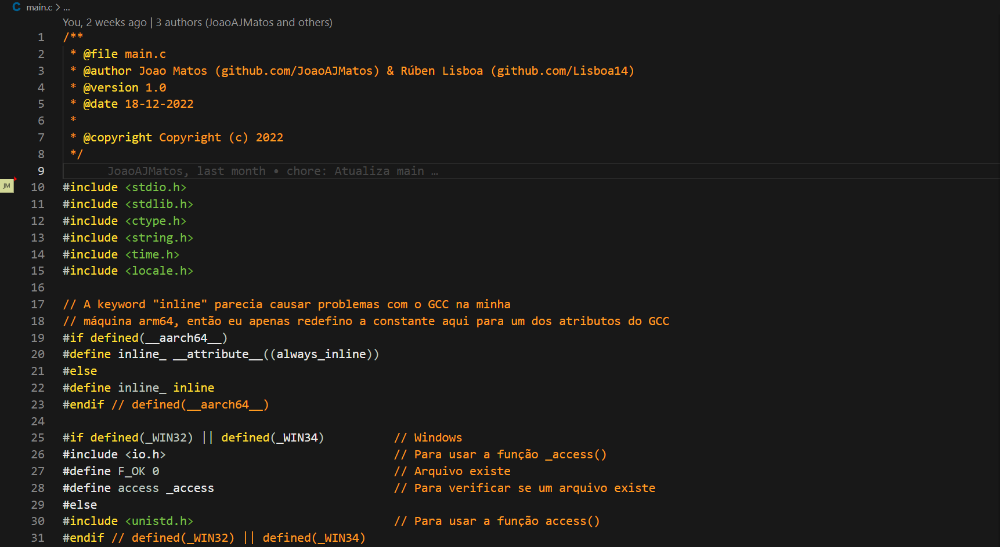
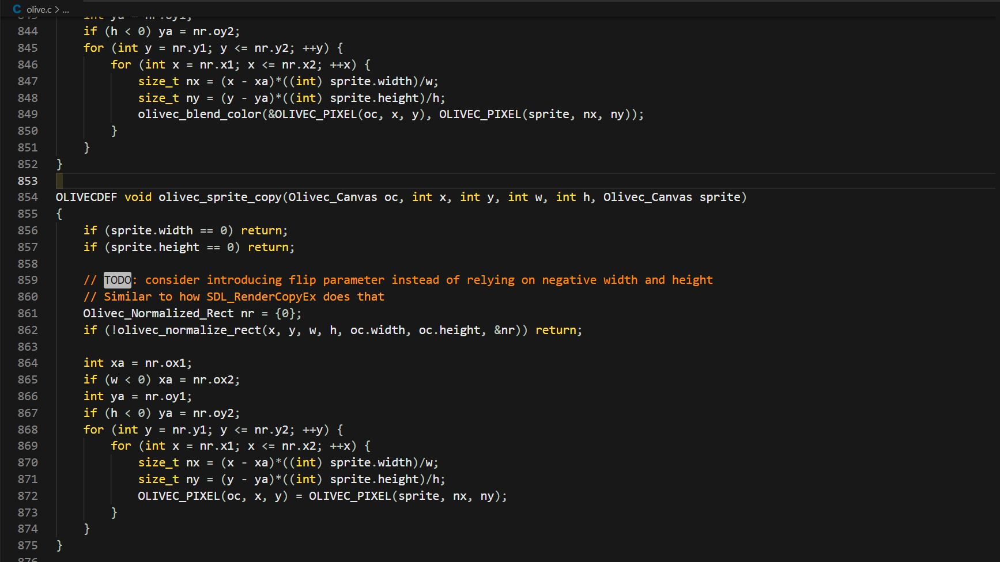

 

      

# Tsoding Color Theme

[Tsoding's](https://www.youtube.com/@TsodingDaily) __new__ color theme for Visual Studio Code.

This theme is an adaptation of [Tsoding-Color-Theme-unofficial](https://github.com/BasisDeveloper/Tsoding-Color-Theme-unofficial) by BasisDeveloper.

### Installation

1. Open the **Extensions** sidebar in VS Code. `View → Extensions`
2. Search for `Tsoding Theme`
3. Click **Install** to install it.

Or click [this link](https://marketplace.visualstudio.com/items?itemName=JoaoAJMAtos.tsoding-theme) to install it directly from the marketplace.

## Screenshots

      
      

### Recommendations

For the best experience, I recommend using the following text font:

`Ubuntu Mono`

This is the same font Tsoding uses in Emacs.

### Suggestions

If you have any suggestions for the further development of this theme, please feel free to [open an issue](https://github.com/JoaoAJMatos/Tsoding-Color-Theme/issues/new) under the `suggestion` label.
